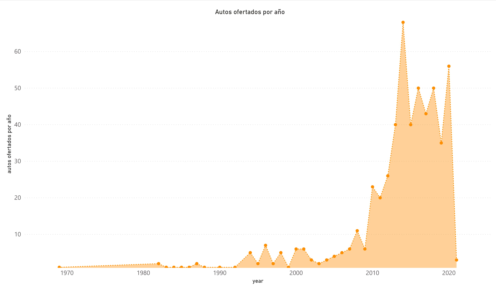
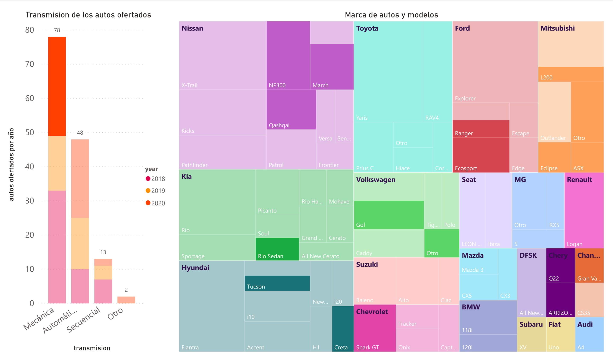
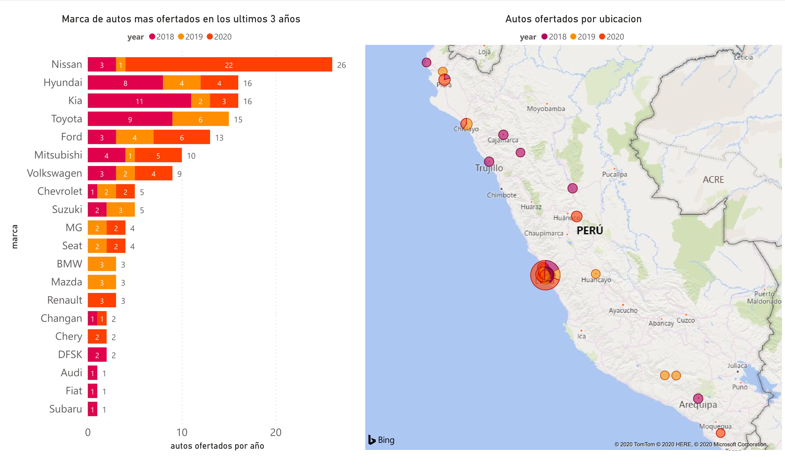

# SCRAPING ON OLX USING SELENIUM AND POSTGRESQL
I developed a script for download text information and images from olx. I provide you a sql file where you can find all data that I extract for you, it must be used only for test.  

All data was obteined from this page
<b>https://www.olx.com.pe/vehiculos_c362</b>

#### Packages
<ul>
    <li>pip install selenium   #scrap</li>
    <li>pip install requests   #http request</li>
    <li>pip install keyboard   #user key board detection</li>
    <li>pip install psycopg2   #postgresql driver</li>
    <li>pip install sqlalchemy  #ORM for postgresql</li>
    <li>pip install yaml   #yaml file</li>
    <li>pip install pandas  #data structuring on tables and data management</li>
    <li>pip install Pillow  #image management library</li>
    <li>pip install multiprocessing  #to run code on parallel behavior</li>
</ul>    

#### Run cript

If you are using Chrome over windows you only need to pass the URL from OLX section cars.
<ol>
    <li>
        <b> >> python main.py run >URL_OLX ></b>
    </li>
</ol>

If you are using firefox over windows.
<ol>
    <li>
        <b>>> python main.py run >URL_OLX > -tb f </b>
    </li>
</ol>

On both previously command we only get data on text form, if you want to download images use the next command
<ol>
    <li>
         Chrome: 
        <b> >> python main.py run >URL_OLX > -tb c -img True </b>
    </li>
    <li>
         Firefox: 
        <b>>> python main.py run >URL_OLX > -tb f -img True </b>
    </li>
</ol>

#### Watch previously downloaded data
Run the next command  
<b>>> python main.py show</b>

#### Some Results
I plot this charts using <b>POWER BI :)</b>
 
<b>Compras por año</b>

<b>Marca de autos y modelos ofertados en el año 2018, 2019, 2020</b>

<b>Total de vehiculos ofertados por region</b>

#### Contactos
<b>yurihuallpavargas@gmail.com</b>
